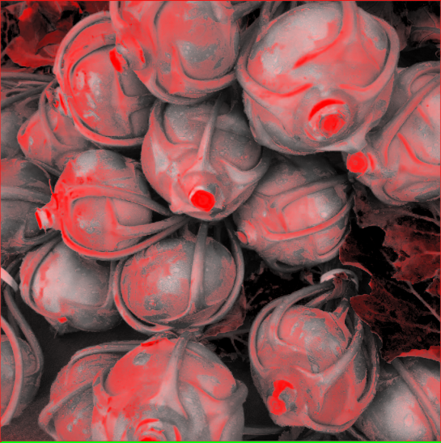

# 色彩影像实验

## 实验目的

给定原始图像和一张目标图像，建立原始图像进行色彩映射到目标图像的颜色映射，在想得原始图像的新的图像中进行色彩的映射变换。
 
## 实验思路
 
1. 对原始图像和目标图像Hue通道分别建立直方图，观察其颜色分布。
2. 按出现频率进行排序获得原始图像和目标图像的色彩映像表
3. 针对色彩映像对原始图像的Hue通道进行变换。

## 实验结果

忽略了色调和亮度的的变化，可能同为红色但是在色调上存在差异