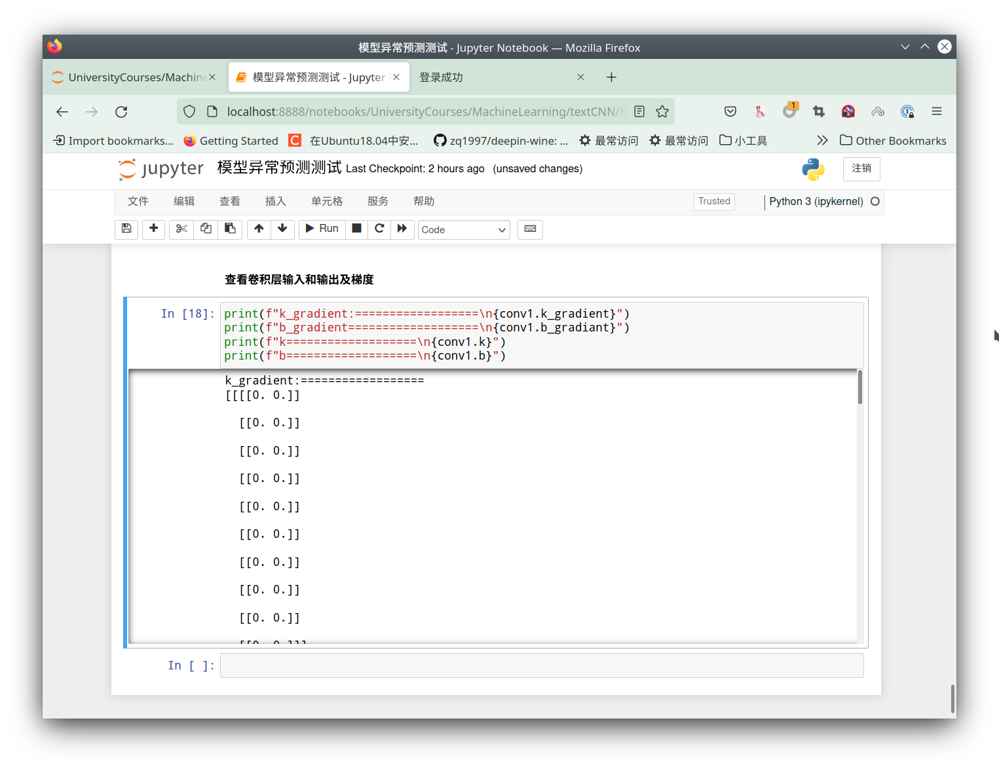

## 1. textCNN 数学推导


## 2. textCNN编程实现

### 2.1 基本网络结构图

### 2.2 基本神经网络层级实现

#### 2.2.1 CNN前向传播

#### 2.2.2 CNN反向传播

#### 2.2.3 Relu 前向传播

#### 2.2.4 Relu 反向传播

#### 2.2.5 pool前向传播

#### 2.2.6 pool反向传播

#### 2.2.7 nn 前向传播

#### 2.2.8 nn 反向传播

#### 2.2.9 softmax 前向传播

#### 2.2.10 softmax 反响传播

#### 2.2.9 损失函数定义

### 2.5 参数调整优化

- 归一化输入数据

- CNN
  - 含有padding
  - 不同步长
- 激活函数
  - relu 
  - sigmod
- pooling
  - max_pooling
  - average_pooling
  - k-gram
- 损失函数
  - 交叉熵
  - 均方差损失
- 训练
  - 批样本batch
  - 单样本

### 2.6 评价展示

- AUC值
- ROC曲线
- 实际效果展示

### 2.7 定义数据接口

假设对于一段文本  I like apple ，我们设计其词向量为4维我们有如下的数据输入

```
I 		-> [1,0,0,0],
like	-> [0,1,0,1],
apple	-> [0,1,1,0],
```

如上所示构成一个文本向量矩阵作为单样本的输入

当面临多样本构成的数据集输入时，我们约定在以三维矩阵进行存储，具体来说，更高一维度代表序号，其他同上

```
eg. I like |  your son
[	
	[	[0,1,0,1]
		[1,0,1,1]],
	[	[1,0,1,1]
		[1,1,2,3]z],
]
```

## 3. 笔记


测试集上准确率是89%

## 4.日志

随机生成30组数据但是无法拟合，错误率一直在

出现了负损失？？

### 4.1 异常收敛

出现了收敛，但是对于结果来说分类异常

```
softmax:  [0.60842953 0.39157047]
softmax:  [0.60842953 0.39157047]
softmax:  [0.60842953 0.39157047]
softmax:  [0.60842953 0.39157047]
softmax:  [0.60842953 0.39157047]
....
softmax:  [0.5907397 0.4092603]
softmax:  [0.5907397 0.4092603]
softmax:  [0.5907397 0.4092603]
softmax:  [0.5907397 0.4092603]
```

最终训练的趋势变为了均匀分布


#### 推测1 测试数据

可能和输入数据有关输入数据严格遵守均值为0的随机分布

尝试使用自定义数据进行测试

```
[[[	[0.1],
    [0.1],
    [0.1],
    [0.1],
    [0.1],
    [0.1],
    [0.1],
    [0.1],
    [0.1],
    [0.1]],

    [[0.1],
    [0.1],
    [0.1],
    [0.1],
    [0.1],
    [0.1],
    [0.1],
    [0.1],
    [0.1],
    [0.1]],

    [[0.1],
    [0.1],
    [0.1],
    [0.1],
    [0.1],
    [0.1],
    [0.1],
    [0.1],
    [0.1],
    [0.1]],

    [[0.8],
    [0.8],
    [0.8],
    [0.8],
    [0.8],
    [0.8],
    [0.8],
    [0.8],
    [0.8],
    [0.8]],

    [[0.8],
    [0.8],
    [0.8],
    [0.8],
    [0.8],
    [0.8],
    [0.8],
    [0.8],
    [0.8],
    [0.8]],

    [[0.8],
    [0.8],
    [0.8],
    [0.8],
    [0.8],
    [0.8],
    [0.8],
    [0.8],
    [0.8],
    [0.8]],

      [[0.2],
       [0.2],
       [0.2],
       [0.2],
       [0.2],
       [0.2],
       [0.2],
       [0.2],
       [0.2],
       [0.2]],

      [[0.2],
       [0.2],
       [0.2],
       [0.2],
       [0.2],
       [0.2],
       [0.2],
       [0.2],
       [0.2],
       [0.2]],

      [[0.2],
       [0.2],
       [0.2],
       [0.2],
       [0.2],
       [0.2],
       [0.2],
       [0.2],
       [0.2],
       [0.2]]],
       # ================================
     [[[0.8],
       [0.8],
       [0.8],
       [0.8],
       [0.8],
       [0.8],
       [0.8],
       [0.8],
       [0.8],
       [0.8]],

      [[0.8],
       [0.8],
       [0.8],
       [0.8],
       [0.8],
       [0.8],
       [0.8],
       [0.8],
       [0.8],
       [0.8]],

      [[0.8],
       [0.8],
       [0.8],
       [0.8],
       [0.8],
       [0.8],
       [0.8],
       [0.8],
       [0.8],
       [0.8]],

      [[0.1],
       [0.1],
       [0.1],
       [0.1],
       [0.1],
       [0.1],
       [0.1],
       [0.1],
       [0.1],
       [0.1]],

      [[0.1],
       [0.1],
       [0.1],
       [0.1],
       [0.1],
       [0.1],
       [0.1],
       [0.1],
       [0.1],
       [0.1]],

      [[0.1],
       [0.1],
       [0.1],
       [0.1],
       [0.1],
       [0.1],
       [0.1],
       [0.1],
       [0.1],
       [0.1]],

      [[0.1],
       [0.1],
       [0.1],
       [0.1],
       [0.1],
       [0.1],
       [0.1],
       [0.1],
       [0.1],
       [0.1]],

      [[0.1],
       [0.1],
       [0.1],
       [0.1],
       [0.1],
       [0.1],
       [0.1],
       [0.1],
       [0.1],
       [0.1]],

      [[0.1],
       [0.1],
       [0.1],
       [0.1],
       [0.1],
       [0.1],
       [0.1],
       [0.1],
       [0.1],
       [0.1]]],
       #===========================================
     [[[0.3],
       [0.3],
       [0.3],
       [0.3],
       [0.3],
       [0.3],
       [0.3],
       [0.3],
       [0.3],
       [0.3]],

      [[0.3],
       [0.3],
       [0.3],
       [0.3],
       [0.3],
       [0.3],
       [0.3],
       [0.3],
       [0.3],
       [0.3]],

      [[0.3],
       [0.3],
       [0.3],
       [0.3],
       [0.3],
       [0.3],
       [0.3],
       [0.3],
       [0.3],
       [0.3]],

      [[0.2],
       [0.2],
       [0.2],
       [0.2],
       [0.2],
       [0.2],
       [0.2],
       [0.2],
       [0.2],
       [0.2]],

      [[0.1],
       [0.1],
       [0.1],
       [0.1],
       [0.1],
       [0.1],
       [0.1],
       [0.1],
       [0.1],
       [0.1]],

      [[0.1],
       [0.1],
       [0.1],
       [0.1],
       [0.1],
       [0.1],
       [0.1],
       [0.1],
       [0.1],
       [0.1]],

      [[0.6],
       [0.6],
       [0.6],
       [0.6],
       [0.6],
       [0.6],
       [0.6],
       [0.6],
       [0.6],
       [0.6]],

      [[0.6],
       [0.6],
       [0.6],
       [0.6],
       [0.6],
       [0.6],
       [0.6],
       [0.6],
       [0.6],
       [0.6]],

      [[0.6],
       [0.6],
       [0.6],
       [0.6],
       [0.6],
       [0.6],
       [0.6],
       [0.6],
       [0.6],
       [0.6]]]]
```

实验显示对结果无明显影响推测可能和反向传播有关

#### 推测2 反向传播

在去除多个卷积层保留最基本的简单结构下仍然出现了异常收敛的问题初步断定为全连接层或卷积层的反响传播或者误差计算的问题排除卷积融合的问题，具体表现为随着训练的进行loss在一区间内收敛，但是softmax结果显示的分类结果为[0.5 0.5]及当前目标即可能属于0也可能属于1二者等概率


思考后觉得 可能发生了梯度消失，原模型的输入数据来自图像0～255 而现有的数据来自随机生成的浮点数0～1，但是在将输入数据扩到到0～255后仍然存在。

关于表现出的0.5 0.5 他们是softmax归一化后的结果，向上逆推为两个相同的预测结果且极有可能是0 因为只有exp(0) 才能保持主0.5 稳定不变


结果一致发现全连接层的输入变成了0在运算后加入偏置进而导致相同的输出，由于在softmax运算中采用了最大值进行归一化，进而导致exp(0)的发生。

发现flatten正向传播出现错误生成了全0矩阵，修复后发现前期恢复正常，但是后期flatten矩阵输入全部为0，继续向前推导

池化层没问题，但是在卷积层发生了卷积梯度为0 的情况，偏置不为0，查看卷积核部分参数，均不为0但是大部分均为负数，这样卷积出的结果




观察此时随着迭代次数的增加loss变为Nan反而在反向增大出现了梯度爆炸


通过归一化数据和减小学习率可以缓解梯度爆炸的问题

### 4.2 正确率判断有误

发现正确率出现了问题和并且进一步推测误差更新产生的loss=Nan也于此有关,

推测可能和卷积数目过少有关，增加卷积核个数

- flatten正向传播设置出错

在定义网络为

```python
# 卷积层
conv1 = Net.Conv(kernal=(3,100,1,20),stride=1)
conv2 = Net.Conv(kernal=(4,100,1,20),stride=1)
conv3 = Net.Conv(kernal=(5,100,1,20),stride=1)

# 激活函数Relu
relu1 = Net.Relu()
relu2 = Net.Relu()
relu3 = Net.Relu()

# 池化层
max_pooling1 = Net.Pool(ksize=18)
max_pooling2 = Net.Pool(ksize=17)
max_pooling3 = Net.Pool(ksize=16)

# Flatten 层
flatten1 = Net.Flatten()
flatten2 = Net.Flatten()
flatten3 = Net.Flatten()

# Concat融合
concat1 = Net.Concat()

# 全连接层
fc1 = Net.Fc( 60,2)

# softmax
softmax = Net.Softmax()
```

正确率在60～80%徘徊

### 4.3 loss 收敛后反向增大至inf后又下降

> 一组数据预测结果为1


查看训练后的数据发现参数均存在参数数量级上存在异常，但根据初期损失正确收敛可能是边界或者传播的误差发生了突变

出现了卷积权重梯度收敛近似等于0的情况后，此时其他层参数一切正常，此时继续正常收敛损失


出现小幅动损失上扬后继续收敛

卷积权重梯度持续累计，池化层出现远大于其余值的超值，此时网络输出接近0.5-0.5


卷积处梯度的第二维度持续增大，同时对应的偏置也再增大 loss:1.386524458334709 softmax:[[0.50821692 0.49178308]]


损失进一步减小 loss:1.3864330933174176 right_rate :0.0 softmax:[[0.49331563 0.50668437]] 此时预测出显了错误


池化层输入输出数据进一步扩大


loss发生了突增 epoch:0/100 loss:1.4188493374991638 right_rate :1.0 softmax:[[0.58954157 0.41045843]]


观察了下全连接层数出此时为72 75


考虑一个问题我们的误差求得对吗？


我们采用**delta(2) = softmax(2)-标签(1)**的差值作为误差delta的计算，softmax结果而言总和为0～1 各也就是说如果标签是1,2标签我们永远也不可能得到一个正确的更新公式，具体来说对于对于标签1～2来说对于delta他的无论取自于哪个分量其大小总是小于1的进而我们也只能在一个方向上取不断优化结果这也是本来计算结果正确在不断迭代下成为loss=inf/Nan的原因以及为什么随着训练次数迭代softmax总是收敛到[0.5 0.5]的原因

那么我们该如何设计一个误差函数作为我们结果的更新标准呢？

有两个注意的点

- 更新梯度大小——度量到边界的距离
- 更新的方向——一个可被超越的边界

将直接做差改为one-hot标签 1 将预测趋势拉近 0 出 排斥预测 和上述一致

### 4.4 调优

训练的结果为校验集上取得了66%的正确率

| 技巧                                                        | 测试结果                       |
| ----------------------------------------------------------- | ------------------------------ |
| 最大值池化采用滑动窗口在不同的位置分别取最大值max->stride=2 | 66% 71%                        |
| 减少卷积核的个数20->2                                       | 60% 64% 66%                    |
| 减少卷积核的个数20->10(平衡精度和训练速度)                  | 65%                            |
| 增大batch_size 20->50                                       | 62%                            |
| 减小batch_size 20->10                                       | 61%                            |
| 增加卷积核的数目20->40                                      | 67%                            |
| 增加学习率衰减                                              | 显著提高了训练后期收敛的稳定性 |
| 引入超松弛量增加梯度更新系数 u×old + （1-u)*new             |                                |

在通过校验集计算准确率，精确率，召回率，F1值后发现正样本召回率为0负样本为100% 这可能也是正确率一直维持在60-70%的原因之一，可能存在样本的不均衡问题


## 参考资料


